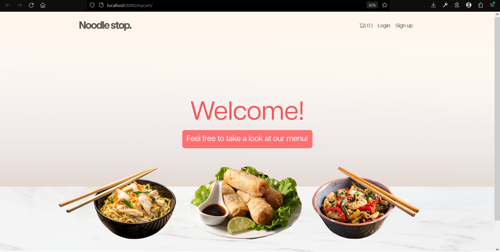
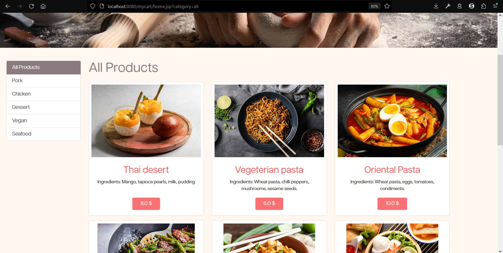
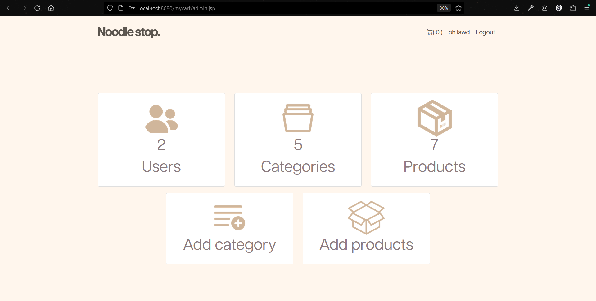

## NoodleStop Java

Noodle stop is a Full-Stack Java Web E-Commerce Application.

The application handles both user and admin accounts, for which the admin can add or remove products/categories from the admin page.
The project is made with pure Java Hibernate and the database is in MySQL.
The frontend is made with HTML, CSS, Javascript and Bootstrap.

# Usage:
1. Clone the repository using this command: 
```bash
git clone https://github.com/danielaburnaz/noodle-stop.git
```
2. Make sure that the mysql code is inserted in your mysql
3. Run the project using Apache Netbrains IDE or Eclipse

# Landing Page


# Product Page


# Admin Page

